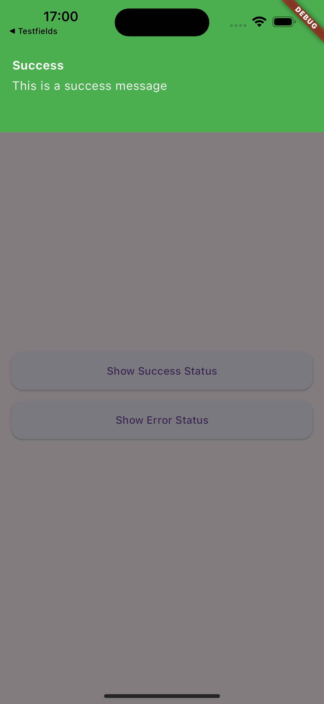
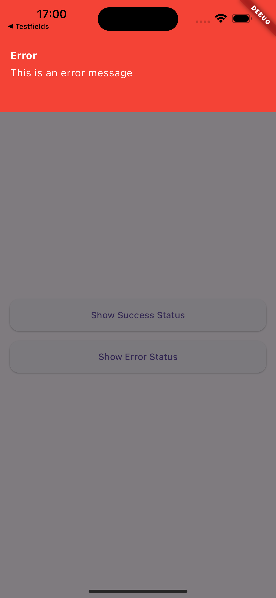
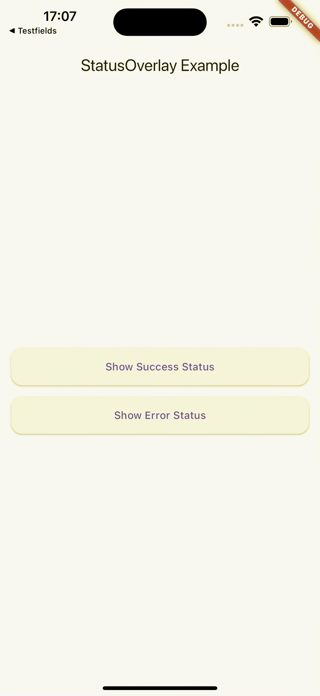

# Flutter Status Overlay

Flutter Status Overlay is a customizable, easy-to-use package for displaying status messages and notifications in Flutter applications. It provides an elegant way to show both success and error messages with a smooth animation overlay.

## Features

- Display temporary overlay messages for both success and error states
- Customizable appearance including colors and text styles
- Adjustable display duration
- Smooth slide-in and slide-out animations
- Easy to integrate into any Flutter application
- Dismissible by tapping outside the message area

## Screenshots & Demo
<table>
  <tr>
    <td></td>
    <td></td>
    <td></td>
  </tr>
</table>


This demonstration showcases the key features of Flutter Status Overlay:

- First, two status messages are displayed:
    1. A success message
    2. An error message
       Both automatically close after a set duration (5 seconds in this example)

- Next, two more status messages are shown:
    1. Another success message
    2. Another error message
       These can be dismissed by tapping anywhere on the screen

This demo illustrates the flexibility of Flutter Status Overlay, allowing for both timed and user-initiated dismissal of status messages.

[View full video](https://github.com/larivasi/flutter_status_overlay/raw/main/screenshots/demo.mp4)

## Installation

Add this to your package's `pubspec.yaml` file:

```yaml
dependencies:
  flutter_status_overlay: ^0.0.1
  ```
## Then run:
`$ flutter pub get`

## Usage

Import the package in your Dart code:

```dart
import 'package:flutter_status_overlay/flutter_status_overlay.dart';
```

To display a status message, use the `StatusOverlay.show()` method:

```dart
StatusOverlay.show(
  context,
  title: 'Success',
  message: 'Operation completed successfully!',
  type: StatusType.success,
  duration: const Duration(seconds: 3),
);

```

To display an error message:

```dart
StatusOverlay.show(
  context,
  title: 'Error',
  message: 'An error occurred during the operation.',
  type: StatusType.error,
  duration: const Duration(seconds: 3),
);
```

## Parameters

The `StatusOverlay.show()` method accepts the following parameters:

- `context:` The build context (required)
- `title:` The title of the status message (required)
- `message:` The content of the status message (required)
- `type:` The type of status (StatusType.success or StatusType.error) (required)
- `duration:` The duration for which the overlay should be displayed (optional, defaults to 5 seconds)

## Example

Here’s a simple example of how to use Flutter Status Overlay in your app:

```dart
import 'package:flutter_status_overlay/flutter_status_overlay.dart';

void main() {
  runApp(const MyApp());
}

class MyApp extends StatelessWidget {
  const MyApp({Key? key}) : super(key: key);

  @override
  Widget build(BuildContext context) {
    return MaterialApp(
      home: Scaffold(
        appBar: AppBar(title: const Text('StatusOverlay Example')),
        body: Center(
          child: Column(
            mainAxisAlignment: MainAxisAlignment.center,
            children: [
              ElevatedButton(
                child: const Text('Show Success Status'),
                onPressed: () {
                  StatusOverlay.show(
                    context,
                    title: 'Success',
                    message: 'This is a success message',
                    type: StatusType.success,
                    duration: const Duration(seconds: 3),
                  );
                },
              ),
              const SizedBox(height: 20),
              ElevatedButton(
                child: const Text('Show Error Status'),
                onPressed: () {
                  StatusOverlay.show(
                    context,
                    title: 'Error',
                    message: 'This is an error message',
                    type: StatusType.error,
                    duration: const Duration(seconds: 3),
                  );
                },
              ),
            ],
          ),
        ),
      ),
    );
  }
}

```


## Customization

The appearance of the status overlay is customized based on the `StatusType`. Success messages are displayed with a green background, while error messages have a red background. The text color is white for both types.

## Contributions

Contributions are welcome! If you encounter any issues or have suggestions for improvements, please file an issue on the [GitHub repository](https://github.com/larivasi/flutter_status_overlay).

## License

This project is licensed under the MIT License - see the [LICENSE](https://github.com/larivasi/flutter_status_overlay/blob/main/LICENSE) file for details.
